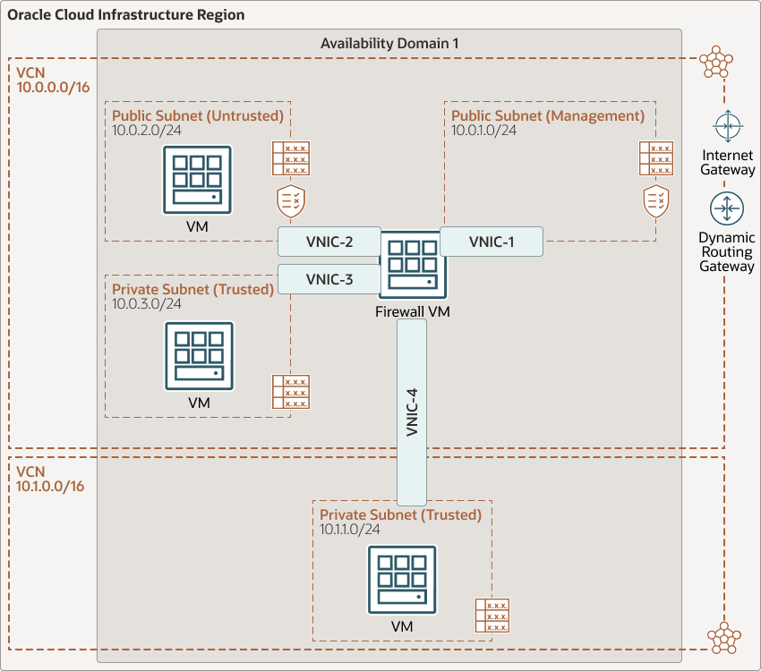

# terraform-oci-arch-virtual-firewall

Although Oracle Cloud Infrastructure offers network security controls through security lists and network security groups, in some scenarios different types of network security are required. For those scenarios, Oracle Cloud Infrastructure uses virtual cloud networks (VCN) and subnets to lay the different segments of the network, and the firewall to handle the security controls.

For details of the architecture, see [Protect your cloud resources using a virtual firewall](https://docs.oracle.com/en/solutions/deploy-virtual-firewall/)

## Architecture Diagram



## Terraform Provider for Oracle Cloud Infrastructure
The OCI Terraform Provider is now available for automatic download through the Terraform Provider Registry. 
For more information on how to get started view the [documentation](https://www.terraform.io/docs/providers/oci/index.html) 
and [setup guide](https://www.terraform.io/docs/providers/oci/guides/version-3-upgrade.html).

* [Documentation](https://www.terraform.io/docs/providers/oci/index.html)
* [OCI forums](https://cloudcustomerconnect.oracle.com/resources/9c8fa8f96f/summary)
* [Github issues](https://github.com/terraform-providers/terraform-provider-oci/issues)
* [Troubleshooting](https://www.terraform.io/docs/providers/oci/guides/guides/troubleshooting.html)

## Prerequisites

- Permission to `manage` the following types of resources in your Oracle Cloud Infrastructure tenancy: `vcns`, `internet-gateways`, `route-tables`, `network-security-groups`, `subnets`, and `instances`.

- Quota to create the following resources: 2 VCN, 4 subnets, 1 Internet Gateway, 2 route rules,  and 4 compute instance.

If you don't have the required permissions and quota, contact your tenancy administrator. See [Policy Reference](https://docs.cloud.oracle.com/en-us/iaas/Content/Identity/Reference/policyreference.htm), [Service Limits](https://docs.cloud.oracle.com/en-us/iaas/Content/General/Concepts/servicelimits.htm), [Compartment Quotas](https://docs.cloud.oracle.com/iaas/Content/General/Concepts/resourcequotas.htm)

- OCID of compartments with Security Zone and without Security Zone enabled

## Deploy Using Oracle Resource Manager

1. Click [](https://cloud.oracle.com/resourcemanager/stacks/create?region=home&zipUrl=https://github.com/oracle-devrel/terraform-oci-arch-virtual-firewall/releases/latest/download/terraform-oci-arch-virtual-firewall-stack-latest.zip)


If you aren't already signed in, when prompted, enter the tenancy and user credentials.

2. Review and accept the terms and conditions.

3. Select the region where you want to deploy the stack.

4. Follow the on-screen prompts and instructions to create the stack.

5. After creating the stack, click **Terraform Actions**, and select **Plan**.

6. Wait for the job to be completed, and review the plan.

    To make any changes, return to the Stack Details page, click **Edit Stack**, and make the required changes. Then, run the **Plan** action again.

7. If no further changes are necessary, return to the Stack Details page, click **Terraform Actions**, and select **Apply**. 

## Deploy Using the Terraform CLI

### Clone the Module and initialize 

You'll want a local copy of this repo. You can make that with the commands:

    git clone https://github.com/oracle-devrel/terraform-oci-arch-virtual-firewall
    cd terraform-oci-arch-virtual-firewall
    ls

You'll need to do some pre-deploy setup.  That's all detailed [here](https://github.com/cloud-partners/oci-prerequisites).
Initialize them in  `terraform.tfvars` file and populate with the following information:

```
# Authentication
tenancy_ocid         = "<tenancy_ocid>"
user_ocid            = "<user_ocid>"
fingerprint          = "<finger_print>"
private_key_path     = "<pem_private_key_path>"

# Region
region = "<oci_region>"

# Compartment
compartment_ocid = "<compartment_ocid>"

```

NOTE: There are other variables that are assigned default value such as VCN CIDR and others. These can be changed in variables.tf file

Deploy:

    terraform init
    terraform plan
    terraform apply


## Destroy the Deployment 
When you no longer need the deployment, you can run this command to destroy it:

    terraform destroy
